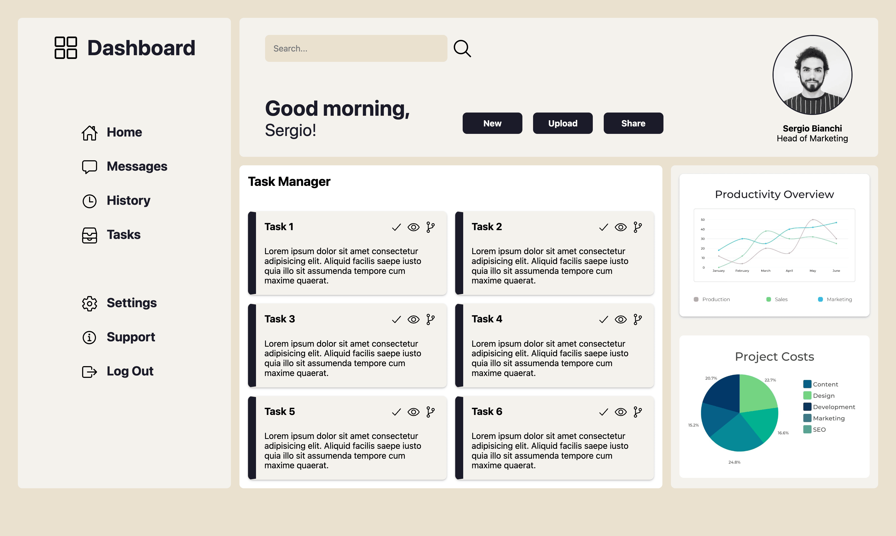

# Admin Dashboard #

  

  

  <a href="https://scottwright-dev.github.io/odin-project-admin-dashboard/">Click here for demo</a>

### Description
Construct an Administrator Dashboard desktop interface utilising the CSS Grid. The primary goal of this project was to enhance comprehension of the grid system for generating intricate layout designs.

### Technologies used:
- HTML
- CSS

### Thoughts and Observations

This project offered an opportunity to delve extensively into the CSS Grid. Although combining Flexbox with Grid could potentially result in a more responsive design, the project's specifications explicitly necessitated maximizing the use of CSS Grid.

I began constructing the code by employing a CSS normalize file as the groundwork. By incorporating my own custom CSS variables and adopting the BEM naming methodology, I  created code that is more maintainable and readable compared to my previous projects.

 
### Credits
- Profile Photo: <a href="https://unsplash.com/@sspaula">Sergio de Paula</a> via <a href="https://unsplash.com/">Unslpash</a>
- Color palette: <a href="https://huemint.com/">huemint.com</a>
- Icons: <a href="https://ionic.io/ionicons">ionic.io</a>
- Graphs: <a href="https://www.canva.com/">canva.com</a>
